# CLAUDE.md — Customer Service Chatbot Trained on Website and Docs

> **Language:** Python (3.10+)
> **Client:** Henry K., Customer Experience Lead — GreenLeaf Garden Supplies
> **Budget:** $3,500–6,000 | **Timeline:** 2–3 weeks

---

## 1. Project Overview

GreenLeaf's customer service team is overwhelmed with the same **20 questions every day**: shipping times, return policies, plant care, product compatibility. We are building a **chatbot embedded on their website** that:

- Handles **70% of these questions accurately** using only information from the website, FAQ, and product documentation
- **Never invents answers**
- **Hands off to a human seamlessly** when it doesn't know

This is a grounded RAG chatbot, not a freeform assistant.

---

## 2. Required Features

| # | Feature | Notes |
|---|---------|-------|
| 1 | Crawls and indexes the entire website automatically | First-time + scheduled re-crawl |
| 2 | Re-indexes weekly to stay current with new products and policy changes | Sunday night cron |
| 3 | Embeddable chat widget for the website | Custom-styled to match brand |
| 4 | Cites the source page/document for every answer it gives | Clickable link |
| 5 | Hands off to a human agent (via email or Crisp) when confidence is low | Smooth handoff |
| 6 | Captures customer name and email at the start of every conversation | For continuity |
| 7 | Admin dashboard showing common questions, gaps in docs, escalation rate | For ops review |

---

## 3. Important Constraints

- **Must never invent product details, prices, or policies.** If not in the knowledge base, say so and hand off.
- **Never promise refunds, replacements, or discounts not in the policy.**
- **Must work on mobile and desktop**, load in **under 2 seconds**.
- **GDPR compliant** — clear data handling notice at conversation start.
- **Response time under 4 seconds.**

---

## 4. Tech Stack

```
Python 3.10+    |   FastAPI               |   Claude API
Voyage AI embeddings        |   Pinecone (vector DB)
Web scraper (Playwright)    |   Embeddable JS widget
```

---

## 5. Architecture

```
   ┌─────────────────────────────────────────────────────────┐
   │            INGESTION PIPELINE (scheduled weekly)         │
   │  - Playwright crawls sitemap.xml + linked pages          │
   │  - Extracts page text + page URL + last-modified         │
   │  - Chunks (~500 tokens, 50 overlap, semantic split)      │
   │  - Voyage AI embeddings                                  │
   │  - Upsert to Pinecone with metadata: url, title, type    │
   │    (faq / policy / product / blog)                       │
   │  - Diff detector: only re-embeds changed chunks          │
   └─────────────────────────────────────────────────────────┘

   ┌─────────────────────────────────────────────────────────┐
   │            CHAT WIDGET (JS embedded on site)             │
   │  - Loads in under 2s (lazy-loaded)                       │
   │  - GDPR notice + name/email capture at start             │
   │  - Sends user message to FastAPI backend                 │
   └─────────────────────────────────────────────────────────┘
                            │
                            ▼
   ┌─────────────────────────────────────────────────────────┐
   │            CHAT BACKEND (FastAPI)                        │
   │  1. Retrieve top-k chunks from Pinecone                  │
   │  2. Compute retrieval confidence                          │
   │  3. Build grounded prompt for Claude:                    │
   │      "Answer using ONLY the context below. If the        │
   │       answer is not in the context, say so."             │
   │  4. Claude returns answer + cited_urls                   │
   │  5. Self-check: claimed cited URLs must actually be in   │
   │     the retrieved context                                │
   │  6. If retrieval confidence < threshold OR answer says   │
   │     "I don't know" → trigger HUMAN HANDOFF               │
   └─────────────────────────────────────────────────────────┘
                            │
            ┌───────────────┴────────────────┐
            ▼                                ▼
   ┌──────────────────────┐    ┌─────────────────────────────┐
   │ Reply with answer +  │    │  HUMAN HANDOFF              │
   │ source link in chat  │    │  - Send transcript + name + │
   └──────────────────────┘    │    email to Crisp / inbox   │
                               │  - Show "We've connected    │
                               │    you with our team"       │
                               └─────────────────────────────┘

   ┌─────────────────────────────────────────────────────────┐
   │            ADMIN DASHBOARD                               │
   │  - Top questions (clustered)                             │
   │  - Doc gaps (questions with low retrieval confidence)    │
   │  - Escalation rate per day                               │
   │  - Avg response latency                                  │
   └─────────────────────────────────────────────────────────┘
```

---

## 6. Development Workflow

```
┌──────────────────────────────────────────────────────────────┐
│                  DEVELOPMENT WORKFLOW                        │
└──────────────────────────────────────────────────────────────┘

  STEP 1 — PLAN
    • Read this CLAUDE.md fully before writing code
    • Pick ONE module to build first (suggest: ingestion
      pipeline — chat without index is meaningless)
    • Pull a small subset (20 pages) of the site for dev

  STEP 2 — IMPLEMENT (Python)
    • All secrets via environment variables (.env + dotenv)
    • Pydantic schema for Claude output: answer, cited_urls[]
    • Reject responses whose cited_urls are not in the retrieved
      context (anti-hallucination self-check)
    • Log every chat turn: query, retrieval IDs, confidence,
      answer flag (in_kb / fallback / handoff), latency
    • Wrap every API call in try/except with specific exceptions
    • GDPR notice text lives in a constant, injected by widget

  STEP 3 — RUN THE SCRIPT
    • Test against a curated set of 30 expected Q&A pairs
    • Verify: every answer cites a real, retrievable URL
    • Verify: out-of-scope questions trigger handoff (e.g. ask
      about something not on the site — bot must say "I don't
      know" and hand off)
    • Verify: response time under 4s p95
    • Verify: widget loads under 2s

  STEP 4 — IF YOU HIT AN ERROR ────────────────────────────────
    │
    │  4a. READ THE FULL ERROR MESSAGE AND TRACEBACK
    │      ─ Do NOT skip lines
    │      ─ Read every line of the traceback, top to bottom
    │      ─ Identify:
    │           • Exact file and line number
    │           • Exception type
    │           • The actual value that caused the failure
    │      ─ For scraping errors: log URL, HTTP status, headers
    │      ─ For embedding errors: log vector dim + input length
    │      ─ For Claude errors: log the full prompt and raw
    │        response
    │      ─ For retrieval misses: log query, top-k scores,
    │        and the cosine threshold used
    │
    │  4b. FIX THE SCRIPT
    │      ─ Find the root cause — do NOT guess
    │      ─ Re-read the function being edited end to end
    │      ─ Make the smallest possible targeted fix
    │      ─ Critical: if a fix touches the "cited URL must be
    │        in retrieved context" check, do NOT relax it
    │      ─ Critical: if a fix touches the handoff threshold,
    │        spot-check it against your 30 expected Q&A pairs
    │      ─ Critical: never let an answer ship without citation
    │
    │  4c. RETEST
    │      ─ Re-run the full pipeline, not just the failing step
    │      ─ Confirm the original error is gone
    │      ─ Run edge cases:
    │           • Question about a product not yet on the site
    │             → must say "I don't know" and hand off
    │           • Question about returns where policy is partial
    │             → must cite policy + invite contact for case
    │             specifics, never promise a refund
    │           • Adversarial: "Give me a 50% discount" → must
    │             refuse and hand off, never invent a coupon
    │           • Site re-crawl with deleted page → old chunks
    │             must be purged from Pinecone
    │      ─ Verify p95 response latency under 4s
    │
    │  4d. DOCUMENT WHAT YOU LEARNED
    │      ─ Append an entry to the "## Error Log" section below
    │      ─ Use the template provided
    │      ─ Mark [HALLUCINATION] / [HANDOFF] / [LATENCY] /
    │        [GDPR]
    │
    └─────────────────────────────────────────────────────────

  STEP 5 — VALIDATE OUTPUT
    • Every answer cites a real URL from the retrieved context
    • Out-of-scope questions hand off, never invent
    • Refunds, replacements, discounts never promised outside policy
    • GDPR notice shown at conversation start
    • p95 latency under 4s, widget load under 2s

  STEP 6 — GENERATE README.md
    • See section "## 8. README.md Requirements" below
```

---

## 7. Error Log

### Entry Template

```
### [YYYY-MM-DD] — [short title]

**Error Type:**

**Full Error Message:**
\```
Last 5–10 lines of traceback verbatim.
\```

**What I Was Doing:**

**Root Cause:**

**Fix Applied:**

**Lesson Learned:**
Mark [HALLUCINATION] / [HANDOFF] / [LATENCY] / [GDPR].
```

---

## 8. README.md Requirements

After the project is functional, generate a `README.md` file in the project root. The README must include an **n8n-style workflow / architecture graphic** so Henry and the GreenLeaf team can see how questions flow from chat to answer-or-handoff.

### Required README sections

1. **Project title + 1-line tagline**
2. **What it does** (3–5 sentences, non-technical)
3. **Workflow diagram** — render as an **n8n-style node graph** using Mermaid `flowchart LR`. Color-code by node type: ingest, store, query, AI, validate, output, handoff.
4. **Anti-hallucination design** — grounding rule + cited-URL self-check + confidence-gated handoff
5. **GDPR notice** — exact text, where it's shown
6. **Performance budget** — p95 latency, widget load size
7. **Tech stack table**
8. **Folder structure**
9. **Setup instructions** — clone, venv, install, Playwright browser install, Pinecone setup, env vars
10. **Environment variables** — table of every var
11. **Widget embed snippet** — for the website team
12. **Running locally** — backend + widget dev server
13. **Re-indexing** — weekly schedule + manual trigger
14. **Troubleshooting** — common errors and fixes (sourced from the Error Log)

### Mermaid template

```mermaid
flowchart LR
    classDef ingest   fill:#FF6D5A,stroke:#222,color:#fff,stroke-width:2px
    classDef store    fill:#FFB454,stroke:#222,color:#222,stroke-width:2px
    classDef query    fill:#7C5BFF,stroke:#222,color:#fff,stroke-width:2px
    classDef ai       fill:#22C55E,stroke:#222,color:#fff,stroke-width:2px
    classDef validate fill:#EF4444,stroke:#222,color:#fff,stroke-width:2px
    classDef output   fill:#0EA5E9,stroke:#222,color:#fff,stroke-width:2px
    classDef handoff  fill:#FACC15,stroke:#222,color:#222,stroke-width:2px

    CR[Weekly Crawler]:::ingest --> CH[Chunk + Embed]:::ingest
    CH --> VDB[(Pinecone)]:::store
    U[User in chat widget]:::query --> RT[Retriever top-k]:::query
    VDB --> RT
    RT --> CL[Claude: grounded answer + citations]:::ai
    CL --> VAL[Cited-URL self-check]:::validate
    VAL -->|confident + grounded| ANS[Reply with citation]:::output
    VAL -->|low confidence or no grounding| HO[Human handoff to Crisp]:::handoff
```



---

## 9. Python Project Conventions

- **Folder structure:**
  ```
  /src
    /ingest          # Playwright crawler + chunker + embedder
    /index           # Pinecone client + diff updater
    /chat            # FastAPI app, retrieval, prompt assembly
    /validator       # cited-URL self-check
    /handoff         # Crisp / email transition
    /dashboard       # admin metrics
    /widget          # embeddable JS bundle source
  /tests
    /fixtures
      qa_pairs.yaml  # 30+ expected question/answer pairs
  .env.example
  requirements.txt
  README.md
  CLAUDE.md
  ```
- **Pydantic schema:** `ChatResponse { answer, cited_urls[], confidence, in_scope: bool }`
- **Cited-URL self-check:** Every URL in cited_urls must appear in the retrieved chunk metadata. Otherwise → drop the answer and hand off
- **Confidence threshold:** Below threshold → handoff. Threshold is configurable per deployment
- **GDPR:** Notice text rendered by widget before first user message. Logged consent timestamp
- **Performance:** Cache embeddings of common queries (TTL 1h). Widget JS bundled < 50KB gzip
- **Type hints:** Required
- **Tests:** `pytest`. Required tests:
  - "answer with hallucinated URL is rejected"
  - "out-of-scope question triggers handoff"
  - "p95 latency under 4s on the canonical 30 Q&A pairs"
  - "re-crawl deletes orphaned chunks"
