# GreenLeaf Customer Service Chatbot

> A grounded RAG chatbot for GreenLeaf Garden Supplies — answers customers from the website & docs, cites every source, and hands off to a human the moment it isn't sure.

> **Note:** GreenLeaf Garden Supplies is a fictional client used for the brief in [CLAUDE.md](CLAUDE.md). The code is fully functional — point `CRAWL_ROOT_URL` at any real site and supply real API keys to use it for production.

---

## What it does

GreenLeaf's customer service team was answering the same 20 questions every day (shipping, returns, plant care, product specs). This chatbot embeds on the website, indexes the entire site weekly, and handles the top 70% of those questions automatically — citing the page it learned from for every answer. When confidence is low, when the question is out of scope, or when the answer would require a refund / discount / promise outside policy, it hands the conversation off to a human via email or Crisp with the full transcript attached.

---

## Workflow diagram

```mermaid
flowchart LR
    classDef ingest   fill:#FF6D5A,stroke:#222,color:#fff,stroke-width:2px
    classDef store    fill:#FFB454,stroke:#222,color:#222,stroke-width:2px
    classDef query    fill:#7C5BFF,stroke:#222,color:#fff,stroke-width:2px
    classDef ai       fill:#22C55E,stroke:#222,color:#fff,stroke-width:2px
    classDef validate fill:#EF4444,stroke:#222,color:#fff,stroke-width:2px
    classDef output   fill:#0EA5E9,stroke:#222,color:#fff,stroke-width:2px
    classDef handoff  fill:#FACC15,stroke:#222,color:#222,stroke-width:2px

    CR[Weekly Crawler<br/>Playwright + sitemap.xml]:::ingest --> EX[Extract clean text]:::ingest
    EX --> CH[Chunk ~500 tokens<br/>+ semantic split]:::ingest
    CH --> EM1[Voyage AI embed<br/>document side]:::ai
    EM1 --> DIFF{Diff vs Pinecone}:::validate
    DIFF -->|new or changed| VDB[(Pinecone)]:::store
    DIFF -->|orphans| DEL[Delete stale chunks]:::validate
    DEL --> VDB

    U[User in chat widget]:::query --> SES[Session: name, email, GDPR]:::query
    SES --> EM2[Voyage AI embed<br/>query side]:::ai
    EM2 --> RT[Retrieve top-k]:::query
    VDB --> RT
    RT --> CONF{Retrieval<br/>confident?}:::validate
    CONF -->|no| HO[Human handoff<br/>email or Crisp]:::handoff
    CONF -->|yes| CL[Claude<br/>grounded prompt + tool use]:::ai
    CL --> VAL{Cited-URL<br/>self-check}:::validate
    VAL -->|hallucinated URL<br/>or in_scope=false<br/>or no citations| HO
    VAL -->|grounded + cited| ANS[Reply with answer + sources]:::output

    ANS --> LOG[(SQLite turn log)]:::store
    HO --> LOG
    LOG --> DASH[Admin dashboard<br/>top questions, gaps, escalation rate, latency]:::output
```



---

## Anti-hallucination design

Three layers, in order:

1. **Grounded prompt.** The system prompt instructs Claude to answer ONLY from the provided context, never invent products / prices / policies / refunds / discounts, and set `in_scope=false` when the answer isn't in the context. Structured output is enforced via Anthropic tool use — Claude must call the `respond` tool, which returns `{answer, cited_urls[], confidence, in_scope}`.
2. **Cited-URL self-check.** Every URL Claude claims to have cited is checked against the URLs of the actually-retrieved chunks. Even one hallucinated URL → the entire response is discarded and a handoff is triggered. URL normalisation (case-insensitive, trailing slash, fragment) prevents false negatives.
3. **Confidence-gated handoff.** Below the configured `RETRIEVAL_CONFIDENCE_THRESHOLD` (default 0.62), Claude is not called at all — the conversation hands off immediately. If Claude returns `in_scope=true` but no citations, that also triggers handoff: per project rule, "never let an answer ship without citation."

---

## GDPR notice

Shown by the widget before the customer can send their first message:

> Before we begin: GreenLeaf will store your name and email to follow up on your enquiry. Your conversation may be reviewed by our team. By continuing you consent to this use.

A consent checkbox must be ticked. The consent timestamp is recorded in the session record and the timestamp + email are written to the turn log alongside every chat turn.

---

## Performance budget

| Metric | Target | Enforced by |
|---|---|---|
| `/chat` p95 latency | < 4 s | Logged per turn → dashboard |
| Widget JS load | < 2 s, < 50 KB gzip | Single-file vanilla JS, zero dependencies |
| Embedding cache TTL | 1 hour | `EMBED_CACHE_TTL_SECONDS` |

---

## Tech stack

| Layer | Choice | Why |
|---|---|---|
| Language | Python 3.10+ | type hints, asyncio, modern syntax |
| API | FastAPI | async, automatic OpenAPI, easy DI |
| LLM | Anthropic Claude (default `claude-opus-4-7`) | Structured tool-use output; prompt caching |
| Embeddings | Voyage AI `voyage-3` (1024-dim) | Asymmetric document/query embeddings |
| Vector DB | Pinecone serverless | Managed, cosine metric, fast cold-start |
| Crawler | Playwright (Chromium headless) | Renders JS-heavy sites correctly |
| Turn log | SQLite (WAL mode) | Zero-ops, file-based, ample for one site |
| Widget | Vanilla JS | < 50 KB, no build step, works on any site |
| Tests | pytest + in-memory fakes | 62 tests, full pipeline coverage, zero API calls |

---

## Folder structure

```
src/
  ingest/        Playwright crawler, extractor, chunker, embedder, pipeline CLI
  index/         Pinecone client wrapper (upsert, query, delete, hash fetch)
  chat/          FastAPI app, retrieval, prompt assembly, Claude client, session store
  validator/     Cited-URL self-check
  handoff/       Email + Crisp handlers (channel chosen via env)
  dashboard/     SQLite turn logger, metrics aggregations, FastAPI router
  widget/        Embeddable vanilla-JS widget + demo embed page
  config.py      Pydantic Settings — validated env-var loader
  schemas.py     Shared Pydantic models (CrawledPage, Chunk, ChatResponse, ...)
  protocols.py   typing.Protocol seams for embedder, index, claude, crawler
  logging_setup.py  Structured JSON logging

tests/
  fakes.py                       FakeEmbedder, FakeVectorIndex, FakeClaudeClient, FakeHandoffHandler
  fixtures/qa_pairs.yaml         30 canonical Q&A pairs (in_kb / handoff / adversarial)
  test_chunker.py                Semantic chunking + determinism
  test_diff.py                   Diff planner (embed / skip / delete orphans)
  test_extractor.py              HTML chrome stripping
  test_pipeline_integration.py   End-to-end ingest with all fakes
  test_validator.py              Cited-URL self-check
  test_chat.py                   /chat endpoint via TestClient + all fakes
  test_handoff.py                Channel routing + credential gating
  test_dashboard.py              Metrics SQL aggregations

.env.example       requirements.txt       pyproject.toml       CLAUDE.md
```

---

## Setup

### Option A — Docker (recommended)

```bash
git clone <your-repo-url> greenleaf-chatbot && cd greenleaf-chatbot
cp .env.example .env                                   # edit with real keys + DASHBOARD_TOKEN

docker compose up -d api                               # start backend on :8000
docker compose run --rm ingest --max-pages 50          # run first ingest

# Verify
curl http://localhost:8000/health
curl -H "Authorization: Bearer $DASHBOARD_TOKEN" http://localhost:8000/dashboard/latency
```

The `api` container restarts automatically; the `ingest` container only runs when invoked (use a host cron to schedule weekly).

### Option B — Local Python venv

```bash
python -m venv .venv && source .venv/bin/activate     # PowerShell: .venv\Scripts\Activate.ps1
pip install -r requirements.txt
python -m playwright install chromium
cp .env.example .env

python -m src.ingest.pipeline --max-pages 50           # first ingest
uvicorn src.chat.app:app --host 0.0.0.0 --port 8000    # start backend

# Serve the widget demo
python -m http.server -d src/widget 8080               # http://localhost:8080/embed.html
```

---

## Security

- **Dashboard auth** — every `/dashboard/*` request requires `Authorization: Bearer <DASHBOARD_TOKEN>`. With the token empty (the default), the dashboard returns `503` — fail-safe rather than fail-open. Tokens are compared with `secrets.compare_digest` to prevent timing-attack enumeration.
- **Rate limiting** — `/chat` is throttled per-IP (default `30/minute`), `/session/start` more aggressively (`5/minute`). Limits are configurable per deployment via `RATE_LIMIT_CHAT` and `RATE_LIMIT_SESSION`. Backed by `slowapi` in-memory; swap to Redis when scaling to multiple instances.
- **CORS** — locked to `CORS_ORIGINS` (comma-separated list). Set this to the customer's exact domain before going live; do not leave it as `*`.
- **Secrets** — `.env` is in `.gitignore` and `.dockerignore`. Use a secrets manager (AWS Secrets Manager / Doppler / Vault) for real deployments rather than copying `.env` to the server.
- **Non-root containers** — both Dockerfiles create and switch to an `appuser` (UID 1000).

---

## Environment variables

| Variable | Required | Default | Notes |
|---|---|---|---|
| `ANTHROPIC_API_KEY` | ✓ | — | Claude API key |
| `CLAUDE_MODEL` |  | `claude-opus-4-7` | Override to pin a specific model |
| `VOYAGE_API_KEY` | ✓ | — | Voyage AI key |
| `VOYAGE_MODEL` |  | `voyage-3` | Must match `VOYAGE_EMBED_DIM` |
| `VOYAGE_EMBED_DIM` |  | `1024` | Embedding dimension; checked at runtime |
| `PINECONE_API_KEY` | ✓ | — | Pinecone key |
| `PINECONE_INDEX_NAME` |  | `greenleaf-kb` | Index is auto-created if missing |
| `PINECONE_CLOUD` |  | `aws` | `aws` / `gcp` / `azure` |
| `PINECONE_REGION` |  | `us-east-1` | Serverless region |
| `CRAWL_ROOT_URL` | ✓ | — | Site root for crawl |
| `CRAWL_MAX_PAGES` |  | `2000` | Hard cap per run |
| `CRAWL_CONCURRENCY` |  | `4` | Parallel Playwright contexts |
| `CRAWL_REQUEST_TIMEOUT_S` |  | `20` |  |
| `CRAWL_USER_AGENT` |  | `GreenLeafChatbotCrawler/1.0` | Identify yourself to the host |
| `CHUNK_TARGET_TOKENS` |  | `500` |  |
| `CHUNK_OVERLAP_TOKENS` |  | `50` | Must be < target |
| `RETRIEVAL_TOP_K` |  | `6` |  |
| `RETRIEVAL_CONFIDENCE_THRESHOLD` |  | `0.62` | Below this → handoff |
| `HANDOFF_CHANNEL` |  | `email` | `email` or `crisp` |
| `HANDOFF_EMAIL_TO` |  | `support@greenleaf.example` |  |
| `SMTP_HOST/PORT/USER/PASSWORD/FROM` |  | gmail defaults | Required when `HANDOFF_CHANNEL=email` |
| `CRISP_WEBSITE_ID/API_IDENTIFIER/API_KEY` |  | — | Required when `HANDOFF_CHANNEL=crisp` |
| `DB_PATH` |  | `./greenleaf.db` | SQLite turn log |
| `DASHBOARD_TOKEN` | ✓ (prod) | empty | Bearer token for `/dashboard/*`. Empty → 503 (fail-safe). Treat as a password. |
| `RATE_LIMIT_ENABLED` |  | `true` | Master switch for per-IP rate limiting |
| `RATE_LIMIT_CHAT` |  | `30/minute` | Per-IP throttle on `/chat` |
| `RATE_LIMIT_SESSION` |  | `5/minute` | Per-IP throttle on `/session/start` |
| `CORS_ORIGINS` |  | `*` | Comma-separated list of widget origins |
| `APP_ENV` |  | `dev` | `dev` / `staging` / `prod` (hides /docs in prod) |
| `LOG_LEVEL` |  | `INFO` |  |

---

## Widget embed snippet

Paste this once at the bottom of every page on greenleafgardensupplies.example, just before `</body>`:

```html
<script src="https://chatbot-cdn.greenleaf.example/widget.js"
        data-api="https://chatbot-api.greenleaf.example"
        defer></script>
```

The widget self-injects a floating chat button, the GDPR notice, the name/email capture form, and the message UI. No additional CSS or markup needed.

---

## Running locally

Backend (with hot-reload):

```bash
uvicorn src.chat.app:app --reload --port 8000
```

Dashboard endpoints are mounted under `/dashboard` (all require `Authorization: Bearer <DASHBOARD_TOKEN>`):

```
GET /dashboard/top-questions?limit=20
GET /dashboard/doc-gaps?limit=20
GET /dashboard/escalation-rate?days=14
GET /dashboard/latency
```

Widget dev server:

```bash
python -m http.server -d src/widget 8080
# http://localhost:8080/embed.html
```

Tests (zero API calls — full suite runs in ~5 s):

```bash
pytest -v
```

---

## Re-indexing

Weekly cron (Sunday 02:00):

```cron
# Docker:
0 2 * * 0  cd /opt/greenleaf-chatbot && docker compose run --rm ingest >> /var/log/greenleaf-ingest.log 2>&1

# venv:
0 2 * * 0  cd /opt/greenleaf-chatbot && /opt/greenleaf-chatbot/.venv/bin/python -m src.ingest.pipeline >> /var/log/greenleaf-ingest.log 2>&1
```

The diff detector only re-embeds chunks whose `content_hash` changed and **deletes orphan chunks whose source page disappeared** — without this, the bot could cite dead URLs. Manual trigger:

```bash
python -m src.ingest.pipeline                    # full run
python -m src.ingest.pipeline --dry-run          # show plan, no writes
python -m src.ingest.pipeline --max-pages 50     # cap for development
```

---

## Troubleshooting

| Symptom | Likely cause | Fix |
|---|---|---|
| `Voyage returned vector of dim X, expected 1024` | `VOYAGE_MODEL` and `VOYAGE_EMBED_DIM` out of sync | Pick one model, set its dim |
| Crawl finds 0 pages | Site has no `/sitemap.xml` and `CRAWL_ROOT_URL` redirects | Set `CRAWL_ROOT_URL` to the final URL; BFS will discover from there |
| Every chat returns `handoff=true` | Index is empty OR confidence threshold too high | Run `python -m src.ingest.pipeline`; lower `RETRIEVAL_CONFIDENCE_THRESHOLD` |
| `Session not found or expired` | Browser cleared `sessionStorage`, or session > 60 min idle | Widget will re-prompt for name/email automatically |
| Widget can't reach backend | CORS mismatch | Set `CORS_ORIGINS=https://your-site.example` in `.env` |
| `playwright._impl._api_types.Error: Executable doesn't exist` | Browser binary missing | `python -m playwright install chromium` |
| Handoff emails not arriving | SMTP creds not set | Set `SMTP_USER` / `SMTP_PASSWORD` (Gmail app password) |

---

## Test coverage

```
tests/test_chunker.py                 9 tests   semantic chunking + determinism + overlap
tests/test_diff.py                    5 tests   plan_diff: embed / skip / delete
tests/test_extractor.py               6 tests   chrome stripping, heading marker, main landmark
tests/test_pipeline_integration.py   12 tests   end-to-end ingest with all fakes
tests/test_validator.py               7 tests   strict + permissive citation checks
tests/test_chat.py                   12 tests   /chat endpoint, every handoff path
tests/test_handoff.py                 5 tests   channel routing + credential gating
tests/test_dashboard.py               6 tests   top-questions, doc-gaps, escalation, latency
tests/test_dashboard_api.py           6 tests   Bearer-token auth (401 / 503 / 200)
tests/test_rate_limit.py              2 tests   limiter wiring + no-throttle-when-disabled

Total: 70 tests, ~3 s, zero external API calls.
```
